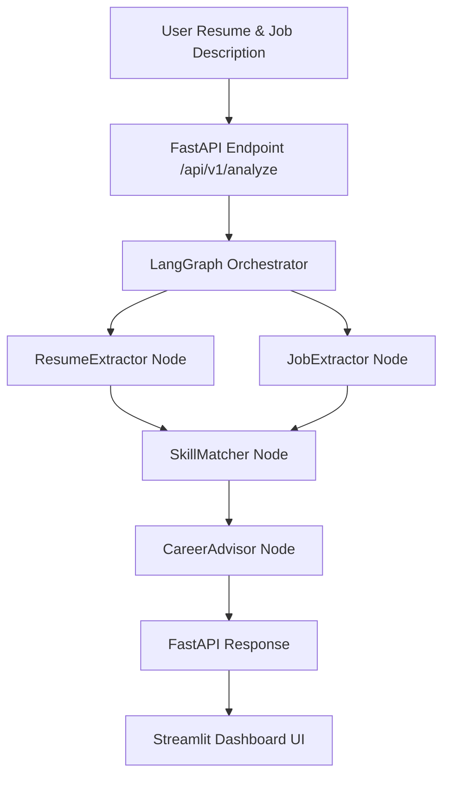

# 🎯 SkillSync AI

AI-powered Career Analysis and Skill Gap Recommendation System built using **FastAPI**, **LangGraph**, **Groq (Llama 3.3)**, and **Streamlit**.

SkillSync AI acts as an agentic career advisor. It extracts technical skills from user resumes and job descriptions, matches them using exact and standardized matching algorithms, calculates compatibility scores, and uses an AI agent to build tailored learning roadmaps, course recommendations, and detailed feedback reports.

---

## 🏗️ System Architecture



---

## ✨ Features

- **Multi-Node Agent Pipeline**: Uses LangGraph to orchestrate stateful AI nodes (`ResumeExtractor`, `JobExtractor`, `CareerAdvisor`).
- **Interactive Dashboard**: A glassmorphic, responsive Streamlit dashboard with dynamic metrics and color indicators.
- **Detailed Analytics**: Displays side-by-side matching and missing technical skills.
- **Custom Upskilling Roadmaps**: Automatically designs customized step-by-step roadmaps.
- **Smart Connection Fallback**: Streamlit dashboard automatically detects backend status and falls back to running the graph pipeline locally if the API is offline.

---

## 🛠️ Getting Started

### Prerequisites

- Python 3.10+
- A Groq API Key

### Installation

1. Clone the repository:
   ```bash
   git clone https://github.com/sidpundirr/Skillsync_AI.git
   cd Skillsync_AI
   ```

2. Create and activate a virtual environment:
   ```bash
   python -m venv .venv
   # On Windows:
   .venv\Scripts\activate
   # On macOS/Linux:
   source .venv/bin/activate
   ```

3. Install dependencies:
   ```bash
   pip install -r requirements.txt
   ```

4. Create a `.env` file in the root directory:
   ```env
   GROQ_API_KEY=your_groq_api_key_here
   ```

### Running the Project

#### 1. Start the FastAPI Backend
```bash
cd backend
python -m uvicorn app.main:app --host 127.0.0.1 --port 8080 --reload
```

#### 2. Start the Streamlit Frontend
In a new terminal window:
```bash
streamlit run frontend/dashboard.py
```
Access the application at [http://localhost:8501](http://localhost:8501).


